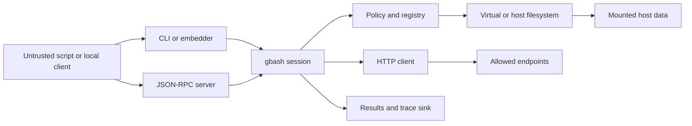

# gbash Threat Model

## Executive summary
For the validated context of local or embedded single-tenant use, `gbash`'s highest-risk areas are the boundaries where untrusted shell text meets host-backed filesystems, optional network egress, and caller-controlled observability sinks. The core runtime does a number of important things correctly by default, including registry-backed command resolution, in-memory filesystem defaults, network-off-by-default behavior, path-policy enforcement, and execution budgets, but the security posture changes materially when an embedder opts into `WithWorkspace`, `ReadWriteDirectoryFileSystem`, `WithHTTPAccess` or `WithNetwork`, `TraceRaw`, or server mode.

## Scope and assumptions
- In-scope paths: `cmd/gbash/`, `cli/`, `api.go`, `options.go`, `internal/runtime/`, `internal/shell/`, `internal/builtins/`, `commands/`, `policy/`, `fs/`, `network/`, `server/`.
- Out-of-scope: CI and release automation, benchmarks, website build and docs, `cmd/gbash-gnu`, optional `contrib/` modules not registered by default, and package publishing/WASM distribution. Those surfaces may matter operationally, but this report is intentionally centered on runtime and sandbox behavior.
- Clarified context: primary deployment is local or embedded single-tenant use, not a multi-tenant internet-facing service.
- Clarified context: host-mounted repositories, environment variables, and tokens are high-sensitivity assets when exposed to the runtime.
- Assumption: the default deployment remains the documented one where unknown commands never fall through to host execution, network stays off unless explicitly enabled, and the default runtime starts with an in-memory filesystem.
- Assumption: stronger containment, if required, is supplied outside `gbash` via a process, container, or VM boundary; the repository explicitly does not claim a hardened OS sandbox.

Open questions that would materially change risk ranking:
- Whether production embeddings ever use `ReadWriteDirectoryFileSystem(...)` outside short-lived temp roots.
- Whether any deployment exposes server mode through the public `server.Serve(...)` API rather than the CLI's loopback and Unix-socket defaults.
- Whether custom registry commands or `WithNetworkClient(...)` implementations are used in production and reviewed as privileged code.

## System model
### Primary components
- CLI and embedding frontends: `cmd/gbash/main.go:main` is a thin wrapper over `cli/run.go:Run`, which can execute one-shot scripts, interactive sessions, JSON output, or JSON-RPC server mode.
- Runtime and session orchestration: `internal/runtime/runtime.go:New` creates the default registry, shell core wiring, policy, network client, base environment, and session factory; `internal/runtime/session.go:Session.exec` resolves cwd and env, applies output caps, and delegates to the shell core.
- Shell core execution path: `internal/shell/core.go:Run` and `internal/shell/command_dispatch.go:executeCommand` construct a fresh `interp.Runner` with explicit env, stdio, open/stat/readdir handlers, call handling, and command execution handlers; unknown commands return `127`.
- Registry-backed command surface: default commands come from `internal/builtins/registry.go:DefaultRegistry`; command stubs under `/bin` and `/usr/bin` are virtual command identities created by `internal/runtime/layout.go:initializeSandboxLayout`.
- Policy and tracing: default policy is created in `internal/runtime/runtime.go:New`; path enforcement and symlink checks are implemented in `policy/pathcheck.go:CheckPath`; trace and log behavior lives in `internal/runtime/observability_runtime.go`.
- Filesystem backends: the default backend is in-memory (`internal/runtime/filesystem.go:InMemoryFileSystem`), with optional read-only host mounts via `fs/host_posix.go:HostFS`, copy-on-write overlay via `fs/overlay.go:OverlayFS`, mutable host roots via `fs/readwrite_posix.go:ReadWriteFS`, and runtime-owned `/dev/null` in `internal/runtime/virtual_devices.go`.
- Optional network client: `network/network.go:New` builds the allowlist-based HTTP client; `internal/builtins/curl.go:RunParsed` reaches it only through `Invocation.Fetch`.
- Optional server mode: `server/server.go:ListenAndServeUnix` and `server/server.go:Serve` expose `session.create`, `session.get`, `session.list`, `session.destroy`, and `session.exec` over JSON-RPC; `server/session.go:serverSession.exec` runs arbitrary shell within the configured sandbox.

### Data flows and trust boundaries
- Untrusted script or local caller -> CLI or embedding API -> `Runtime.Run` / `Session.Exec`
  - Data types: shell text, args, stdin, env overrides, work dir, timeout, startup options.
  - Channel/protocol: local CLI argv/stdin or in-process Go API.
  - Security guarantees: registry-backed commands, no host fallback for unknown commands, explicit execution budgets and output capture limits, deterministic base environment.
  - Validation and enforcement: shell parsing and runner setup in `internal/shell/core.go`, default policy and budgets in `internal/runtime/runtime.go:New`, cwd and env normalization in `internal/runtime/session.go:Session.exec`.
- Local JSON-RPC client -> server mode -> runtime session
  - Data types: JSON-RPC requests including `session_id`, script, args, env, work dir, timeout.
  - Channel/protocol: Unix domain socket or caller-provided listener, including loopback TCP from the CLI.
  - Security guarantees: Unix socket permissions are set to `0600`; CLI rejects non-loopback `--listen` addresses; per-session execution is serialized.
  - Validation and enforcement: request parsing and method dispatch in `server/server.go:parseRPCRequest` and `server/server.go:handleRequest`; there is no built-in authentication or authorization layer.
- Runtime session -> policy and registry -> shell builtins and commands
  - Data types: command names, builtins, argv, path actions, nested executions.
  - Channel/protocol: in-process handler callbacks inside the in-tree shell interpreter.
  - Security guarantees: `AllowCommand`, `AllowBuiltin`, and `AllowPath` are available; unknown commands return `127`; nested `bash` and `sh` remain inside the same session boundary.
  - Validation and enforcement: `internal/shell/core.go:execHandler`, `policy/policy.go`, and `commands/invocation_capabilities.go`.
- Runtime session -> filesystem backend -> host-backed storage when configured
  - Data types: open/stat/readdir/readlink/realpath/mutation requests and file contents.
  - Channel/protocol: in-process filesystem interface (`fs/fs.go:FileSystem`) backed by local filesystem syscalls for host modes.
  - Security guarantees: default memory filesystem, path root checks, default symlink-deny policy, read-only `HostFS`, virtual `/dev/null`, per-file read caps.
  - Validation and enforcement: `commands/invocation_capabilities.go:CommandFS`, `policy/pathcheck.go:CheckPath`, `fs/host_posix.go`, `fs/readwrite_posix.go`, and `internal/runtime/virtual_devices.go`.
- Command execution -> network client -> allowed HTTP targets
  - Data types: URL, method, headers, body, response body, cookies.
  - Channel/protocol: HTTP or HTTPS only.
  - Security guarantees: network is disabled unless explicitly configured; the built-in client enforces URL-prefix allowlists, method controls, redirect revalidation, response size caps, and timeouts.
  - Validation and enforcement: `network/network.go:checkURLAllowed`, `network/network.go:checkPrivateHost`, and `internal/builtins/curl.go:RunParsed`; private-range blocking is optional, not default.
- Runtime session -> results, trace events, and log callbacks -> caller-controlled sink
  - Data types: stdout, stderr, exit code, timing, `FinalEnv`, trace events, and optionally raw argv/path metadata.
  - Channel/protocol: returned result objects, JSON output, server responses, or in-process callbacks.
  - Security guarantees: tracing is opt-in; `TraceRedacted` scrubs common secret-bearing argv fields before recording.
  - Validation and enforcement: `observability.go`, `internal/runtime/observability_runtime.go:newExecutionTraceRecorder`, and `internal/runtime/observability_runtime.go:redactTraceEvent`; stdout, stderr, and `FinalEnv` are not generically redacted.

#### Diagram

## Assets and security objectives
| Asset | Why it matters | Security objective (C/I/A) |
|---|---|---|
| Mounted host workspace contents | Repositories may contain source, secrets, build config, and credentials on disk. | C / I |
| Host temp-root contents in read-write mode | `ReadWriteDirectoryFileSystem` can persist attacker changes back to the host directory. | I / A |
| Sandbox filesystem and session state | Multi-step agent workflows depend on deterministic file state across executions. | I / A |
| Execution environment and `FinalEnv` | Environment values can contain tokens, credentials, or control flags that shape later commands. | C / I |
| Trace, log, and JSON result sinks | These surfaces can replicate argv, paths, stdout, stderr, and timing into wider systems. | C |
| Optional network capability | When enabled, network egress can leak mounted data or reach sensitive internal services. | C / I |
| Server session execution capability | Any reachable `session.exec` surface is an arbitrary shell execution capability within the configured sandbox. | C / I / A |
| Embedding process availability | Local editors, agents, or host apps can be degraded by runaway scripts even without a sandbox escape. | A |

## Attacker model
### Capabilities
- Supply arbitrary shell text, command arguments, and stdin through the CLI, embedding API, or server-mode `session.exec`.
- Use shell builtins and nested execution forms such as `bash`, `sh`, `eval`, `source`, `exec`, `timeout`, and `xargs` from inside the same sandboxed session.
- Read or mutate any files intentionally exposed through the configured filesystem backend and policy roots.
- Observe the stdout, stderr, and result payloads returned to the immediate caller.
- Use `curl` only when the embedder has enabled network access or injected a custom network client.
- Reach server mode if the local transport boundary permits it.

### Non-capabilities
- Cannot make unknown commands fall through to host binaries; unresolved commands return `127`.
- Cannot access network when the runtime is left in its default network-off configuration.
- Cannot widen filesystem roots, register commands, or inject a network client without embedder participation.
- Is not assumed to start with arbitrary Go-code execution in the embedding process or prior host OS compromise.

## Entry points and attack surfaces
| Surface | How reached | Trust boundary | Notes | Evidence (repo path / symbol) |
|---|---|---|---|---|
| CLI one-shot execution | `gbash -c ...`, stdin scripts | Untrusted shell text -> runtime | Thin wrapper over shared CLI frontend. | `cmd/gbash/main.go:main`, `cli/run.go:run` |
| Interactive shell | `gbash` on a TTY or `-i` | Untrusted shell text -> persistent session | Carries filesystem and env state across entries. | `cli/run.go:run`, `README.md` interactive shell section |
| In-process API | `gbash.New`, `Runtime.Run`, `Session.Exec` | Local caller -> runtime session | Primary embedder surface for agent hosts. | `api.go`, `internal/runtime/runtime.go`, `internal/runtime/session.go` |
| JSON-RPC server | `session.create`, `session.exec`, etc. | Local client -> server transport | No protocol auth; transport protection is external. | `server/server.go:handleRequest`, `server/session.go:sessionExecParams` |
| Host-backed filesystem modes | `WithWorkspace`, `HostDirectoryFileSystem`, `ReadWriteDirectoryFileSystem`, `--root`, `--readwrite-root` | Runtime -> host filesystem | This is the main host data boundary. | `cli/runtime_options.go`, `internal/runtime/filesystem.go`, `fs/host_posix.go`, `fs/readwrite_posix.go` |
| Shell builtins and nested execution | `eval`, `source`, `exec`, `bash`, `sh`, `xargs`, `timeout` | Untrusted script -> policy and nested shell | These amplify attacker-controlled work inside the same sandbox. | `internal/shell/core.go:execHandler`, `internal/builtins/bash.go` |
| Network egress | `curl` | Runtime -> outbound HTTP client | Present only when network is configured. | `internal/builtins/curl.go:RunParsed`, `network/network.go` |
| Observability outputs | JSON mode, server results, trace callbacks, logger callbacks | Runtime -> caller-controlled sink | High-signal debugging surface; also a data exfil surface. | `cli/json_output.go`, `server/session.go:sessionExecResult`, `observability.go`, `internal/runtime/observability_runtime.go` |

## Top abuse paths
1. Exfiltrate mounted host workspace contents -> embedder starts `gbash` with `WithWorkspace(...)` or `--root` -> attacker script uses `find`, `grep`, `cat`, or `rg` within the mounted root -> secrets or source leave through stdout, JSON results, or caller-visible logs.
2. Tamper with host files in read-write mode -> embedder uses `ReadWriteDirectoryFileSystem(...)` or `--readwrite-root` -> attacker script modifies or deletes files inside the mapped host directory -> local repository or temp workspace integrity is lost.
3. Abuse nested shell features to amplify work -> attacker uses `eval`, `source`, `bash -c`, `sh -c`, `timeout`, or `xargs` inside the sandbox -> caller assumptions based only on registry command filtering are bypassed -> exfiltration or DoS chains become easier to express.
4. Use enabled `curl` for SSRF or data egress -> embedder enables network with a broad allowlist or custom client -> attacker script posts mounted data to an allowed endpoint or probes internal hosts when private-range blocking is absent -> confidentiality loss or lateral movement.
5. Reach unauthenticated server mode -> another local client can connect to the configured socket or listener -> it calls `session.create` and `session.exec` -> arbitrary scripts run inside the configured sandbox without higher-level auth.
6. Leak secrets through observability -> attacker includes tokens in command args, URLs, output, or environment -> runtime records or returns them via raw trace events, logger callbacks, `FinalEnv`, stdout, or stderr -> data propagates into sinks beyond the immediate task.
7. Exhaust the embedding process -> attacker submits loops, glob fanout, repeated nested shells, or large I/O pipelines -> budgets and truncation eventually trip, but CPU, memory, or responsiveness degrade first -> local editor, agent, or service availability suffers.

## Threat model table
| Threat ID | Threat source | Prerequisites | Threat action | Impact | Impacted assets | Existing controls (evidence) | Gaps | Recommended mitigations | Detection ideas | Likelihood | Impact severity | Priority |
|---|---|---|---|---|---|---|---|---|---|---|---|---|
| TM-001 | Untrusted script | Host-backed filesystem is enabled through `WithWorkspace(...)`, `HostDirectoryFileSystem(...)`, `ReadWriteDirectoryFileSystem(...)`, `--root`, or a custom filesystem; sensitive files exist inside the mounted root. | Enumerate, read, and copy data from the intentionally exposed host subtree. | Disclosure of source, configs, and credentials present inside mounted directories. | Mounted host workspace contents, execution environment artifacts on disk. | Default runtime is in-memory (`internal/runtime/filesystem.go:InMemoryFileSystem`); read-only host mounts use `HostFS` (`fs/host_posix.go`); command-visible file access flows through `CommandFS` and `policy.CheckPath` (`commands/invocation_capabilities.go`, `policy/pathcheck.go`). | Read-only prevents writes, not reads; default policy roots are `/` within the sandbox; broad mounts expose everything under the chosen host directory by design. | Mount the smallest possible subtree; keep secrets outside mounted roots; pair host mounts with explicit `policy.Config` read and write roots; prefer read-only overlays for LLM-generated scripts; add OS isolation for sensitive workloads. | Enable redacted tracing and alert on `file.access` against sensitive paths such as `.env`, `.git`, SSH material, or package manager credentials. | High | High | high |
| TM-002 | Untrusted script | Mutable host mode or custom filesystem is enabled, or a caller uses the library-level read-write helper directly. | Modify, rename, or delete host files inside the mapped root. | Host-side integrity damage, poisoned workspaces, and destructive local changes. | Host temp-root contents, mounted repositories, local work products. | CLI restricts `--readwrite-root` to the system temp directory (`cli/runtime_options.go:ensureReadWriteRootIsTemporary`); path and symlink checks apply through `policy.CheckPath`; `ReadWriteFS` constrains canonical resolution to its configured root (`fs/readwrite_posix.go`). | The tempdir guard is a CLI-only safety rail, not a library-wide guarantee; default write roots are permissive inside the sandbox; destructive commands remain available in the default registry. | Avoid `ReadWriteDirectoryFileSystem(...)` for untrusted scripts outside throwaway temp roots; add explicit write-root restrictions; consider a confirmation or separate execution profile for destructive workflows; run with external snapshotting or rollback when possible. | Track `file.mutation` events and alert on unexpected writes, deletes, or renames under host-backed paths. | Medium | High | high |
| TM-003 | Untrusted script | Network is enabled through `WithHTTPAccess(...)`, `WithNetwork(...)`, or `WithNetworkClient(...)`; mounted data or reachable internal services are sensitive. | Use `curl` to exfiltrate mounted data or reach unintended internal services. | Data egress, SSRF, and potential lateral movement through the host's network position. | Mounted workspace contents, outbound credentials, reachable internal endpoints. | Network is off by default (`README.md`, `internal/runtime/runtime.go:New`); built-in client validates scheme, allowlist prefixes, methods, redirects, size caps, and timeouts (`network/network.go`); `curl` only uses the runtime client via `Invocation.Fetch` (`internal/builtins/curl.go:RunParsed`). | `WithHTTPAccess(...)` only seeds URL prefixes and does not set `DenyPrivateRanges`; broad allowlists are easy to misconfigure; `WithNetworkClient(...)` is a complete escape hatch. | Prefer exact host and path allowlists, not broad origins; set `DenyPrivateRanges=true`; avoid giving the sandbox raw bearer tokens and instead inject auth in a host-side network client; log outbound destinations and methods. | Alert on outbound POST/PUT/PATCH, requests to new hosts, and repeated network denials; record destination URLs in redacted trace mode or surrounding telemetry. | Medium | High | high |
| TM-004 | Untrusted script | Attacker can submit arbitrary shell text or large stdin; runtime is not wrapped in stronger OS-level resource controls. | Drive CPU, memory, or responsiveness loss through loops, glob fanout, nested exec, large file reads, or large outputs. | Local editor, agent host, or embedding process becomes slow, unstable, or unavailable. | Embedding process availability, session responsiveness. | Default budgets cover command count, globs, loops, substitution depth, stdout, stderr, and file size (`internal/runtime/runtime.go:New`, `policy/policy.go`); timeouts are supported in `Session.exec`; response sizes are capped in `network/network.go`. | App-level limits do not guarantee low CPU or memory before they trip; default limits may still be large for desktop or daemon embeddings; no built-in cgroup, seccomp, or process isolation. | Set explicit low timeouts for agent workloads; tune policy budgets downward per use case; cap input sizes before handing data to `gbash`; run `gbash` in a separate process or container with CPU and memory limits. | Monitor timeout exits (`124`), canceled runs, repeated truncation, budget-denied events, and host process RSS or CPU spikes. | High | Medium | high |
| TM-005 | Untrusted script plus permissive observability sink | Tracing, logging, JSON result capture, or server-mode responses are enabled and sensitive data is visible in argv, output, or environment. | Cause secrets to be emitted or recorded through stdout, stderr, `FinalEnv`, raw trace events, or logs. | Confidentiality loss into logs, telemetry, agent memory, or downstream systems. | Environment values, tokens in command args or URLs, task results, trace and log sinks. | Tracing is opt-in (`observability.go`); `TraceRedacted` redacts common secret-bearing argv values before recording (`internal/runtime/observability_runtime.go:redactTraceEvent`); docs warn that `TraceRaw` is unsafe for shared sinks. | Stdout, stderr, and `FinalEnv` are not generally redacted; raw trace mode preserves full argv and path metadata; logger sinks are entirely caller-controlled. | Default to `TraceRedacted`; avoid `TraceRaw` outside tightly controlled local debugging; do not persist `FinalEnv` unless needed; scrub or segregate stdout and stderr for secret-bearing tasks; use host-side auth injection instead of putting secrets in shell commands. | Scan logs and trace sinks for bearer tokens, auth headers, query-string secrets, or package-manager credentials; flag non-dev builds that enable `TraceRaw`. | Medium | High | medium |
| TM-006 | Local client that can reach server transport | Server mode is enabled and another local client can reach the socket or listener, or an embedder exposes `server.Serve(...)` on a broader listener. | Call `session.create` and `session.exec` to run arbitrary shell within the configured sandbox. | Unauthorized access to mounted files, network capability, and local execution slots. | Server session execution capability, mounted host data, runtime availability. | CLI rejects non-loopback `--listen` addresses (`cli/run.go:validateLoopbackListenAddress`); Unix sockets are chmod `0600` (`server/server.go:ListenAndServeUnix`); session execution is serialized and can expire by TTL (`server/session.go`). | The JSON-RPC protocol has no built-in auth or authorization; the public server package accepts any listener; TCP exposure beyond loopback relies entirely on the embedder's transport choices. | Keep server mode disabled unless required; prefer private Unix sockets in per-user directories; if TCP is necessary, wrap with OS firewall rules, mTLS, or an authenticated proxy; treat `session.exec` as a privileged local capability. | Log session lifecycle events at the embedding layer and alert on unexpected local connections or new sessions. | Low | High | medium |
| TM-007 | Untrusted script exploiting caller policy assumptions | Caller relies only on default settings or command allowlists and assumes that risky builtins or nested execution forms are absent. | Use `eval`, `source`, `exec`, `bash`, `sh`, `timeout`, or `xargs` to recompose attacker-controlled behavior inside the sandbox. | Caller's intended restriction profile is weaker than expected, which amplifies exfiltration and DoS paths. | Mounted data, runtime availability, caller policy integrity. | Nested `bash` and `sh` still route back into sandbox execution (`internal/builtins/bash.go`); builtins can be mediated through `AllowBuiltin(...)` (`internal/shell/core.go:allowBuiltin`); unknown commands still never fall through. | Default static policy leaves builtins unrestricted when `AllowedBuiltins` is empty (`policy/policy.go:AllowBuiltin`); there is no hardened preset that disables risky builtins by default. | When using custom policy, explicitly set `AllowedBuiltins`; document that command allowlists alone are not a safe capability profile; test restricted profiles with nested-shell and builtin abuse cases. | Watch for `command.start` events involving `bash`, `sh`, `eval`, `source`, `timeout`, or `xargs` in deployments that expect a reduced shell surface. | Medium | Medium | medium |

## Criticality calibration
For this repository and the validated context, severity depends primarily on whether the embedder has exposed real host data, network egress, or a reachable server transport.

- `critical`
  - A reliable filesystem breakout that lets an untrusted script escape the intended mounted root and read or mutate arbitrary host files.
  - A server deployment that exposes `session.exec` beyond the intended local trust boundary without compensating authentication.
  - A custom extension path that effectively gives untrusted scripts arbitrary host execution or unrestricted network with sensitive mounted data.
- `high`
  - Exfiltration of sensitive files from an intentionally mounted host workspace.
  - Mutation of a host-backed working tree through read-write mode.
  - Network-enabled exfiltration or SSRF when `curl` is enabled with an overly broad allowlist or custom client.
- `medium`
  - Resource exhaustion that hangs or crashes the local embedding process but does not escape the sandbox.
  - Secret leakage through `TraceRaw`, logger callbacks, or unsafely retained result payloads.
  - Policy confusion where builtins or nested shells remain available despite the caller expecting a narrower command surface.
- `low`
  - Noisy information disclosure that stays confined to the default in-memory sandbox and does not touch host-mounted data.
  - Failed SSRF attempts that are already blocked by the allowlist or private-range controls.
  - Output flooding that is visible but already bounded by truncation and easy operator recovery.

## Focus paths for security review
| Path | Why it matters | Related Threat IDs |
|---|---|---|
| `internal/shell/core.go` and `internal/shell/command_dispatch.go` | Central command resolution, builtin mediation, nested execution, compile pipeline wiring, and handler setup for the in-tree shell engine. | TM-004, TM-006, TM-007 |
| `internal/runtime/session.go` | Cwd and env resolution, timeout handling, output capture, and final result shaping all happen here. | TM-004, TM-005 |
| `internal/runtime/runtime.go` | Defines default registry, policy, network wiring, and budget defaults that shape the baseline sandbox posture. | TM-001, TM-003, TM-004 |
| `internal/runtime/layout.go` | Creates the default environment, filesystem layout, and virtual `/bin` command stubs seen by untrusted scripts. | TM-001, TM-007 |
| `policy/pathcheck.go` | Path root enforcement and symlink traversal handling are core to host filesystem containment. | TM-001, TM-002 |
| `policy/policy.go` | Default allowlists and limits live here; default builtin behavior is especially important for restriction profiles. | TM-002, TM-004, TM-007 |
| `fs/host_posix.go` | Read-only host mount boundary; canonicalization and virtual-root mapping determine what a script can really read. | TM-001, TM-002 |
| `fs/readwrite_posix.go` | Mutable host root boundary; canonical path resolution and symlink handling determine host-write containment. | TM-002 |
| `fs/overlay.go` | Copy-on-write behavior above host mounts affects what reads and writes are visible to the script. | TM-001, TM-002 |
| `network/network.go` | URL allowlist logic, redirect handling, private-range checks, response caps, and timeout behavior are all here. | TM-003 |
| `internal/builtins/curl.go` | Main network entry point from untrusted scripts; also a likely place for header, cookie, and output side effects. | TM-003, TM-005 |
| `server/server.go` | Transport handling, socket permissions, request parsing, and listener assumptions define the server trust boundary. | TM-006 |
| `server/session.go` | Session lifecycle and `session.exec` parameter handling define what a reachable client can execute. | TM-006 |
| `commands/invocation_capabilities.go` | Filesystem and network capabilities are wrapped here; mistakes here weaken policy and tracing coverage. | TM-001, TM-002, TM-003 |
| `commands/command.go` | Documents the soft trust boundary for custom commands and the lack of hard enforcement against host-global API use. | TM-007 |
| `internal/runtime/observability_runtime.go` | Trace redaction and log callback behavior determine what secret-bearing metadata reaches sinks. | TM-005 |

## Quality check
- Covered all primary runtime entry points discovered: CLI, in-process API, server mode, host-backed filesystem configuration, network via `curl`, and observability sinks.
- Represented each main trust boundary in at least one threat: script input, local server transport, filesystem backends, network egress, and results or trace sinks.
- Kept runtime and sandbox behavior in scope and intentionally excluded CI, release, website, and optional contrib modules from the main analysis.
- Reflected user clarifications: local or embedded single-tenant deployment, high-sensitivity mounted data and tokens, and runtime-focused scope.
- Left residual deployment-sensitive assumptions explicit where they still affect ranking, especially read-write mode, server exposure, and custom extensions.
